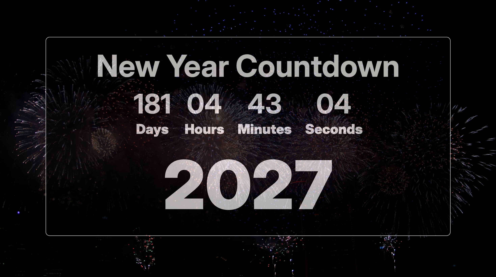

# Countdown Timer

A responsive Countdown Timer web application built using **HTML, CSS, and JavaScript**. The application displays the remaining time until the upcoming New Year in **days, hours, minutes, and seconds**, updating every second.

## Features

- Real-time countdown to New Year
- Displays Days, Hours, Minutes, and Seconds
- Automatic timer update every second
- Responsive and clean UI
- Displays a New Year message when the countdown ends
- Background image support
- Built using JavaScript ES6 classes

## Technologies Used

- HTML5
- CSS3
- JavaScript (ES6)

## Project Structure

```text
Countdown-Timer/
│
├── index.html
├── README.md
│
├── JS/
│   ├── app.js
│   └── countdown.js
│
├── styles/
│   └── style.css
│
└── Images/
    └── fireworks.jpg
```

## How to Run

1. Clone the repository.

```bash
git clone https://github.com/your-username/Countdown-Timer.git
```

2. Open the project folder.

3. Open `index.html` in your browser.

## Screenshot



## Future Improvements

- Multiple countdown events
- Dark/Light mode
- Alarm sound when countdown finishes
- User-defined countdown dates
- Pause and Resume functionality
- Confetti animation on completion

## Author

**Sandeep**

GitHub: https://github.com/Sandeep-Talla-07
